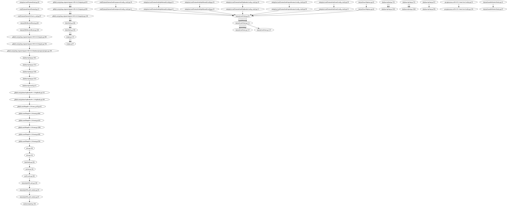

# Go stack dump visualizer

Get [Stack](https://docs.haskellstack.org/en/stable/README/) then:

```
$ stack build
$ stack exec app
Wrote out.dot. Now run: dot -Tpng > out.png
$ dot -Tpng > out.png
```

Then view `out.png`.


